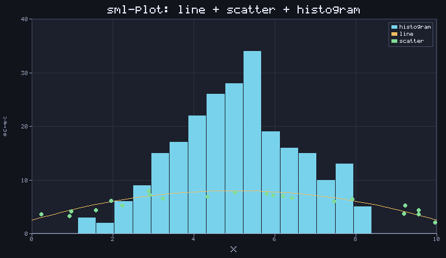

# sml-plot

Charting to PNG in pure Standard ML — line, bar, scatter, and histogram plots
rendered straight onto an [`sml-image`](https://github.com/sjqtentacles/sml-image)
RGBA8 raster, with automatic axis ranges, "nice"-number tick selection,
gridlines, a title, axis labels, and an optional legend. All text is drawn with
the vendored [`sml-font`](https://github.com/sjqtentacles/sml-font) bitmap font,
so a chart is fully self-contained: **no fonts, files, or FFI are read at
runtime**. Output is **deterministic**, byte-identically under both
[MLton](http://mlton.org/) and [Poly/ML](https://www.polyml.org/).

This is the charting layer of the sjqtentacles ecosystem — the demos for
[`sml-fft`](https://github.com/sjqtentacles/sml-fft),
[`sml-stats`](https://github.com/sjqtentacles/sml-stats), and
[`sml-wav`](https://github.com/sjqtentacles/sml-wav) route their spectra,
distributions, and waveforms through `Plot.render`.



*Generated by [`examples/chart.sml`](examples/chart.sml) (`make example`): one
chart combining a `Hist` (240 samples), a `Line` (a sampled parabola), and a
`Scatter`, with a title, gridlines, x/y labels, and a legend — encoded to PNG.
The demo's data is built from exact arithmetic only, so the PNG is byte-identical
across compilers.*

## Status

- 58 assertions, green on MLton and Poly/ML.
- Basis-library only; deterministic across compilers (PNG output is
  byte-identical run to run **and** between MLton and Poly/ML).
- Vendors `sml-font` + `sml-raster` + `sml-image` (and their deps `sml-inflate`,
  `sml-color`) — Layout B — so the repo builds standalone.
- The bundled 5x7 font is embedded as a string ([`src/font_data.sml`](src/font_data.sml),
  generated from [`data/font5x7.bdf`](data/font5x7.bdf) by
  [`tools/embed_font.py`](tools/embed_font.py)), so `render` needs no file I/O.

## Install

With [`smlpkg`](https://github.com/diku-dk/smlpkg):

```
smlpkg add github.com/sjqtentacles/sml-plot
smlpkg sync
```

Include the MLB from your own (it pulls in the vendored `sml-font`, `sml-raster`
and `sml-image`):

```
local
  $(SML_LIB)/basis/basis.mlb
  lib/github.com/sjqtentacles/sml-plot/... (via smlpkg)
in
  ...
end
```

This brings `structure Plot` (and the vendored `Image`, `Raster`, `Font`) into
scope.

## Quick start

```sml
val chart : Plot.chart =
  { width  = 640
  , height = 400
  , series = [ Plot.Line    [(0.0, 0.0), (1.0, 2.0), (2.0, 1.5), (3.0, 3.0)]
             , Plot.Scatter [(0.5, 1.0), (2.5, 2.5)] ]
  , title  = "my chart"
  , axes   = { xlabel = "time", ylabel = "value", grid = true }
  , legend = true }

val img = Plot.render chart                  (* : Image.image *)

val os = BinIO.openOut "chart.png"
val () = BinIO.output (os, Image.encodePng img)
val () = BinIO.closeOut os
```

## API

### The chart spec

```sml
datatype series =
    Line    of (real * real) list     (* connected points, in list order *)
  | Bar     of (string * real) list   (* labelled bars from a zero baseline *)
  | Scatter of (real * real) list     (* discrete points, drawn as marks *)
  | Hist    of real list              (* samples, auto-binned into buckets *)
  | Area    of (real * real) list     (* line filled down to the zero baseline *)
  | Pie     of (string * real) list   (* labelled wedges, sized by |value| *)

type axes = { xlabel : string, ylabel : string, grid : bool }

type chart =
  { width  : int, height : int
  , series : series list
  , title  : string
  , axes   : axes
  , legend : bool }

val render : chart -> Image.image
```

`render` builds the image from scratch and performs no I/O; the caller encodes
it (e.g. `Image.encodePng`). `series` are drawn back-to-front in list order.
Degenerate inputs are handled gracefully: empty series render an empty framed
panel, flat data is padded to a unit range, and non-positive sizes clamp to a
`1x1` image. Numeric series (`Line`, `Scatter`, `Hist`) share one numeric
x-axis; `Bar` is laid out at integer slots `0, 1, 2, …` with each label centred
under its bar; `Hist` bins its samples into `ceil(sqrt n)` (capped at 20)
equal-width buckets.

`Area` draws a `Line` whose region down to the `y = 0` baseline is filled
(a closed filled path through the data points), so 0 is always included in the
y-range. `Pie` is not plotted against the numeric axes: it draws labelled
wedges centred in the plot area, each sized by its `|value|` as a fraction of
the total and filled with its own palette colour. The area fill is composed
from integer-projected polygons, so it is byte-identical across compilers.

### Pure layout maths (exposed and unit-tested)

These are the checkable core of the data→pixel mapping, exposed so they can be
asserted numerically and reused. They use **no** `log`/`pow`/`sin` — only the
four basic arithmetic ops and integer powers of ten — so axis selection is
bit-stable across compilers.

| Function | Type | Notes |
| --- | --- | --- |
| `clamp` | `real -> real -> real -> real` | `clamp lo hi v` into `[lo,hi]` (bounds may be swapped) |
| `niceNum` | `real * bool -> real` | nearest (`true`) / next-up (`false`) `1·2·5`×10ⁿ value (Heckbert) |
| `niceAxis` | `real * real * int -> {lo:real, hi:real, step:real}` | rounded-out bounds + tick step for ~`target` ticks |
| `ticks` | `real * real * int -> real list` | the tick values for `niceAxis` |
| `extent` | `real list -> real * real` | `(min,max)`; `[]`→`(0,1)`, flat data padded by 1 |
| `project` | `{dlo,dhi,plo,phi:real} -> real -> real` | linear map of data→pixel; swap `plo`/`phi` to invert the y-axis |

```sml
Plot.niceAxis (0.0, 100.0, 5)   (* = {lo=0.0, hi=100.0, step=20.0} *)
Plot.ticks    (0.0, 100.0, 5)   (* = [0.0,20.0,40.0,60.0,80.0,100.0] *)
Plot.project { dlo=0.0, dhi=10.0, plo=0.0, phi=100.0 } 5.0   (* = 50.0 *)
```

### Conventions

- **Coordinates**: top-left origin (inherited from `sml-image`); the y-axis
  grows upward on screen via an inverted `project`.
- **Determinism**: pixel coordinates are rounded with `floor(x + 0.5)` (not
  `Real.round`, whose tie-to-even rounding has historically differed between
  compilers), so identical data yields a byte-identical image on MLton and
  Poly/ML.
- **Colours**: a fixed six-colour palette is assigned to series by index; the
  legend mirrors it.

## Build & test

```
make test        # MLton: build + run the suite
make test-poly   # Poly/ML: use-and-run the suite
make all-tests   # both
make example     # render assets/chart.png
make clean
```

## License

MIT — see [LICENSE](LICENSE).
